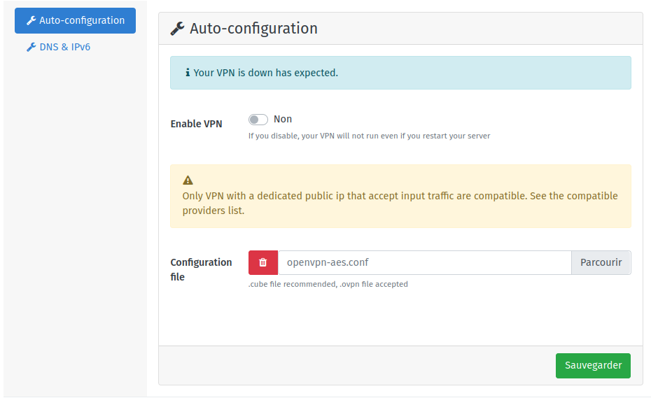

# VPN Client pour YunoHost

[](https://dash.yunohost.org/appci/app/vpnclient)    
[](https://install-app.yunohost.org/?app=vpnclient)

*[Read this readme in english.](./README.md)*
*[Lire ce readme en français.](./README_fr.md)*

> *Ce package vous permet d'installer VPN Client rapidement et simplement sur un serveur YunoHost.
Si vous n'avez pas YunoHost, regardez [ici](https://yunohost.org/#/install) pour savoir comment l'installer et en profiter.*

## Vue d'ensemble

* Installez une connexion VPN sur votre serveur auto-hébergé
* Utile pour héberger votre serveur derrière un accès internet filtré (et/ou non-neutre)
* Utile pour obtenir une IP statique (v4 et v6)
* Utile pour pouvoir facilement déplacer votre serveur
* Pare-feu strict (le traffice entrant et sortant se fait seulement via le pare-feu et ne fuite pas de données à votre FAI commercial)
* Peut-être combiné avec [l'application Hotspot](https://github.com/YunoHost-Apps/hotspot_ynh) pour diffuser un WiFi protégé par le VPN à d'autres laptop sans configuration technique requise sur les machines clientes.


**Version incluse :** 2.0.2~ynh7


## Captures d'écran



## Avertissements / informations importantes

Notez que cette application est prévue pour fonctionner avec des **VPN dédiés et à IP publique qui acceptent le traffic entrant**, et de préférence avec un fichier de configuration `.cube` (ou `.ovpn/.conf`) associé. Un VPN acheté au hasard sur Internet ne fonctionnera sans doute pas ! Consultez [la liste des fournisseurs connus et compatibles](https://yunohost.org/providers/vpn) pour plus d'infos.

## Documentations et ressources

* Documentation YunoHost pour cette app : https://yunohost.org/app_vpnclient
* Signaler un bug : https://github.com/YunoHost-Apps/vpnclient_ynh/issues

## Informations pour les développeurs

Merci de faire vos pull request sur la [branche testing](https://github.com/YunoHost-Apps/vpnclient_ynh/tree/testing).

Pour essayer la branche testing, procédez comme suit.
```
sudo yunohost app install https://github.com/YunoHost-Apps/vpnclient_ynh/tree/testing --debug
ou
sudo yunohost app upgrade vpnclient -u https://github.com/YunoHost-Apps/vpnclient_ynh/tree/testing --debug
```

**Plus d'infos sur le packaging d'applications :** https://yunohost.org/packaging_apps